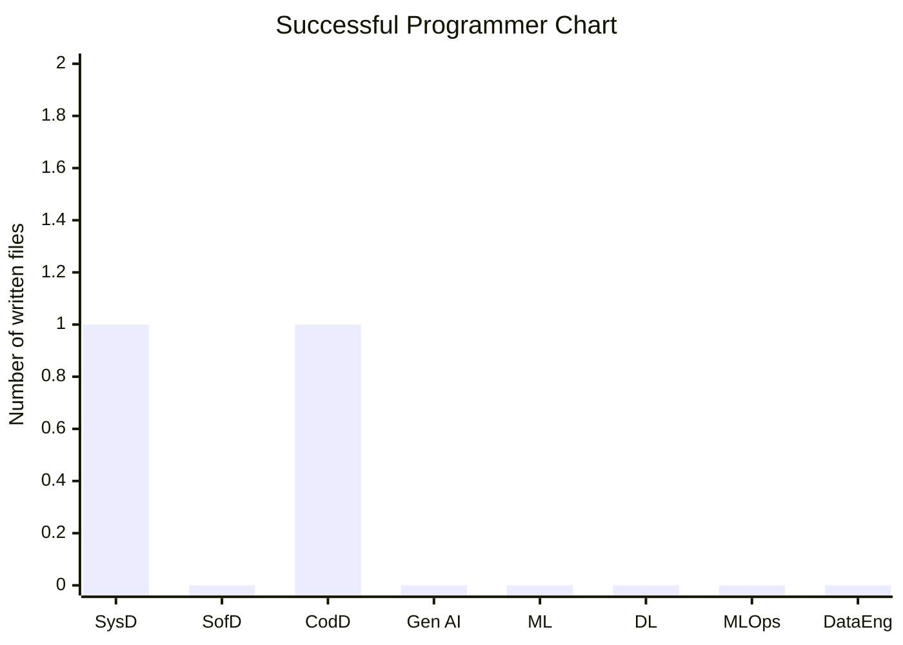

# Succesful Programmer

## System Design

1. Docker
2. Kubernetes
3. Microservices vs. Monoliths
4. API Design (REST, GraphQL)
5. Scalability and High Availability

## Software Design

1. Design Patterns
2. SOLID Principles
3. Architectural Patterns (MVC, MVVM, etc.)
4. Domain-Driven Design (DDD)

## Code Design

1. Clean Code Principles
2. Refactoring Techniques
3. Data Structures and Algorithms
4. Code Review Best Practices
5. TDD (Test-Driven Development)
6. Object-Oriented Programming
   1. Inheritance
   2. Encapsulation
   3. Polymorphismo

## Gen AI

1. Large Language Models (LLMs)
2. Prompt Engineering
3. Retrieval-Augmented Generation (RAG)
4. Fine-tuning & Parameter-Efficient Fine-Tuning (PEFT)

## Machine Learning

1. Supervised Learning (e.g., Regression, Classification)
2. Unsupervised Learning (e.g., Clustering, Dimensionality Reduction)
3. Feature Engineering and Selection
4. Model Evaluation Metrics

## Deep Learning

1. Neural Network Fundamentals
2. Convolutional Neural Networks (CNNs) for Vision
3. Recurrent Neural Networks (RNNs) for Sequences
4. Transformer Architecture

## MLOps

1. CI/CD
2. Model Monitoring
3. Model Versioning
4. Orchestration

## Data Engineering

1. ETL Pipelines
2. Data Warehousing
3. Streaming Data
