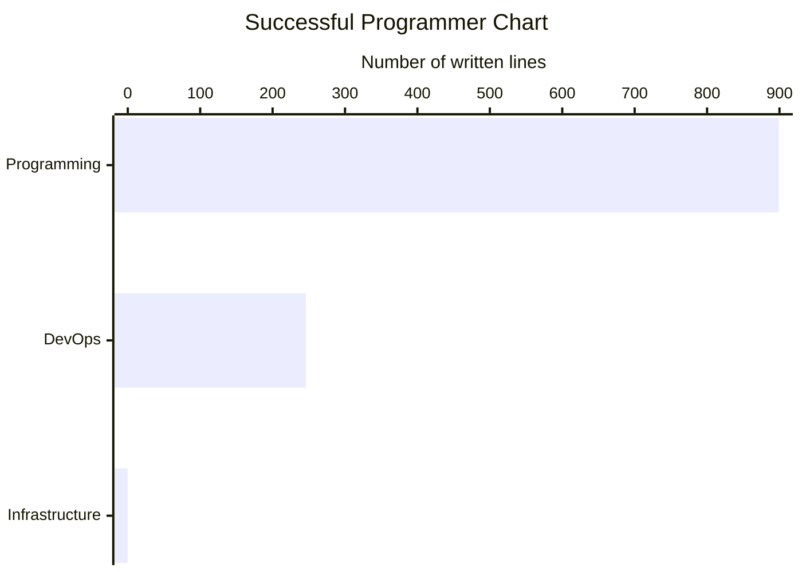

# Succesful Programmer

## Folder Structure

.
├── 00_Meta/                # Management & Planning
│   ├── Inbox/              # Rapid capture (sort these later)
│   ├── Roadmap/            # T-shaped career tracking & Goals
│   └── Templates/          # Foam/Obsidian templates (Daily Note, Paper Summary)
│
├── 01_Foundations/         # The "Horizontal" Bar (Breadth)
│   ├── Computer_Science/   # Algorithms, Data Structures
│   ├── Mathematics/        # Linear Algebra, Stats for ML
│   └── System_Design/      # Scalability, Microservices, SDLC
│
├── 02_Software_Eng/        # The Tools of the Trade
│   ├── Python/             # Patterns, Pytest, Asyncio
│   ├── DevOps/             # Docker, Kubernetes, GitLab_CI
│   └── Cloud_Infra/        # AWS (S3, OpenSearch, Bedrock)
│
├── 03_Machine_Learning/    # AI Core
│   ├── Classical_ML/       # Regression, Trees, Scikit-learn
│   ├── NLP/                # Transformers, Embeddings
│   └── MLOps/              # Weights & Biases, MLflow, Deployment
│
├── 04_Specialization/      # The "Vertical" Bar (Deep Dive)
│   ├── RAG_Systems/        # Vector DBs, Reranking, Retrieval
│   ├── LLM_Agents/         # ReAct, Tool-use, Orchestration
│   └── Eval_Frameworks/    # Ragas, DeepEval, Benchmarking
│
├── 05_Projects/            # Applied Knowledge
│   ├── Active/             # Current builds (e.g., ANBIMA RAG)
│   └── Archive/            # Completed or paused experiments
│
└── 06_Resources/           # External Inputs
    ├── Papers/             # Arxiv summaries
    ├── Books/              # Notes from SDLC/Design Pattern books
    └── Courses/            # Certifications & Tutorials

## Software Engineering

## System Design

1. Docker
2. Kubernetes
3. Microservices vs. Monoliths
4. API Design (REST, GraphQL)
5. Scalability and High Availability

## Software Design

1. Design Patterns
2. SOLID Principles
3. Architectural Patterns (MVC, MVVM, etc.)
4. Domain-Driven Design (DDD)

## Code Design

1. Clean Code Principles
2. Refactoring Techniques
3. Data Structures and Algorithms
4. Code Review Best Practices
5. TDD (Test-Driven Development)
6. Object-Oriented Programming
   1. Inheritance
   2. Encapsulation
   3. Polymorphismo

## Gen AI

1. Large Language Models (LLMs)
2. Prompt Engineering
3. Retrieval-Augmented Generation (RAG)
4. Fine-tuning & Parameter-Efficient Fine-Tuning (PEFT)

## Machine Learning

1. Supervised Learning (e.g., Regression, Classification)
2. Unsupervised Learning (e.g., Clustering, Dimensionality Reduction)
3. Feature Engineering and Selection
4. Model Evaluation Metrics

## Deep Learning

1. Neural Network Fundamentals
2. Convolutional Neural Networks (CNNs) for Vision
3. Recurrent Neural Networks (RNNs) for Sequences
4. Transformer Architecture

## MLOps

1. CI/CD
2. Model Monitoring
3. Model Versioning
4. Orchestration

## Data Engineering

1. ETL Pipelines
2. Data Warehousing
3. Streaming Data
